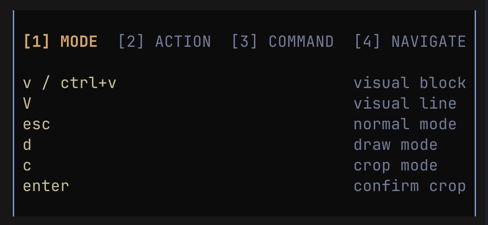

Ascii pixel art editor for the terminal, using braille characters.


## Installation

**macOS / Linux (Homebrew)**
```sh
brew tap Mr-Robot-err-404/perkins
brew install perkins
```

**Linux (curl)**
```sh
curl -sSL https://github.com/Mr-Robot-err-404/perkins/releases/latest/download/perkins_linux_amd64.tar.gz | tar -xz && mv perkins /usr/local/bin/
```

**Go**
```sh
go install github.com/Mr-Robot-err-404/perkins@latest
```

## Usage

```sh
perkins convert <image>   # convert an image to ascii and open the editor
perkins edit <file>       # open an existing ascii file in the editor
```

Navigate with vim motions or use the mouse. 

### Editor

Press `?` inside the editor for the full help menu.



*Named after the [Perkins Brailler](https://en.wikipedia.org/wiki/Perkins_Brailler), a braille typewriter invented by David Abraham.*

## License

MIT
